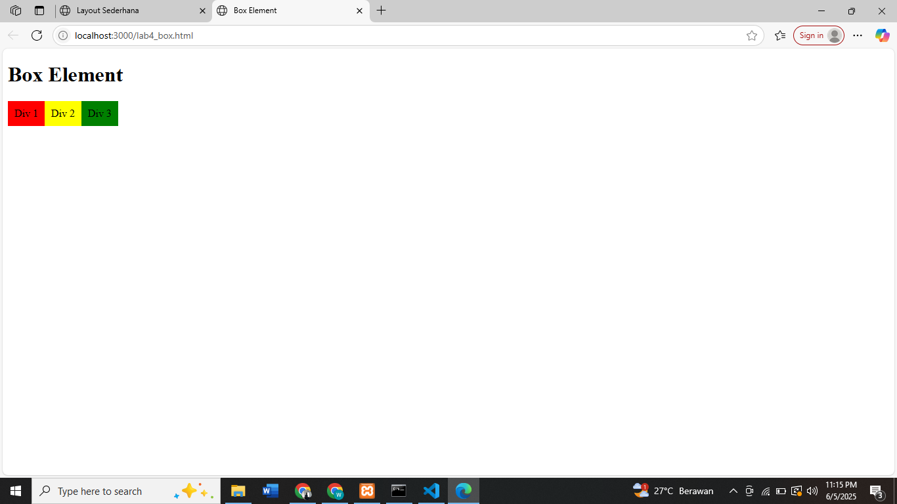
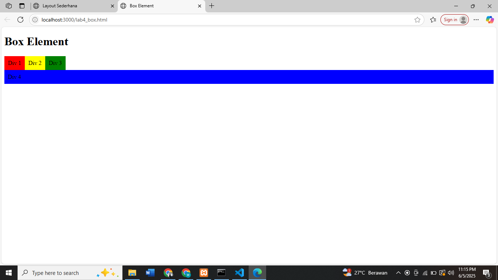
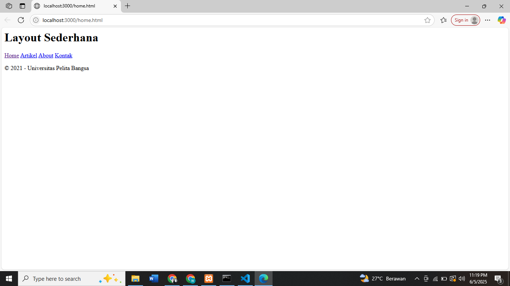
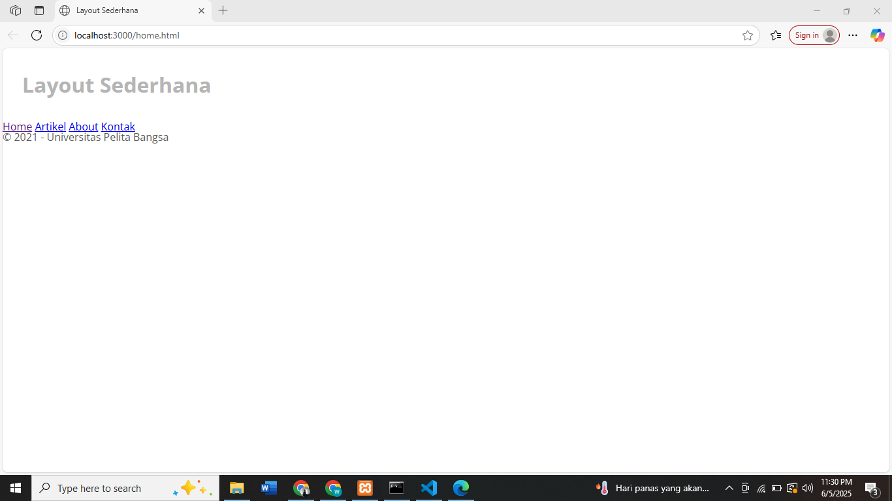
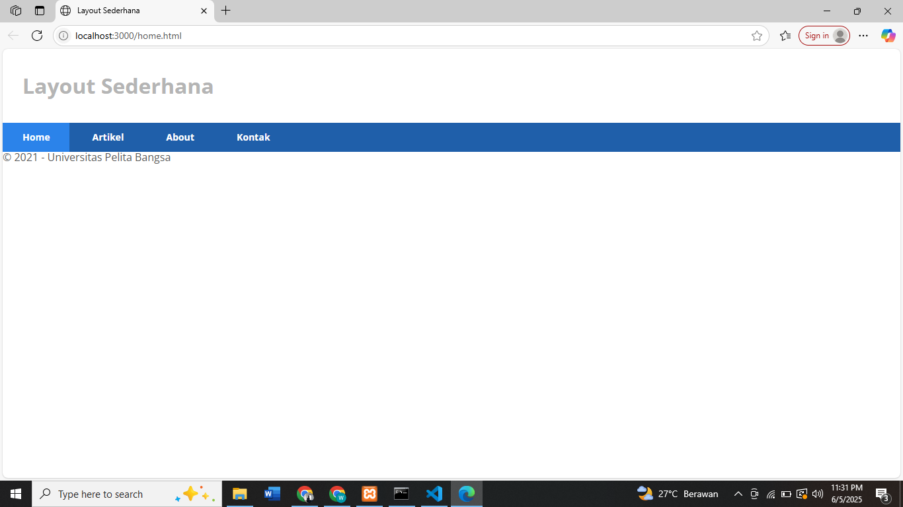
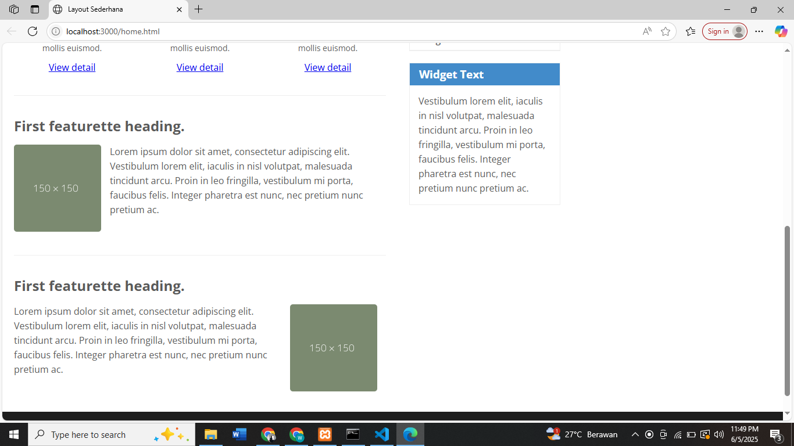
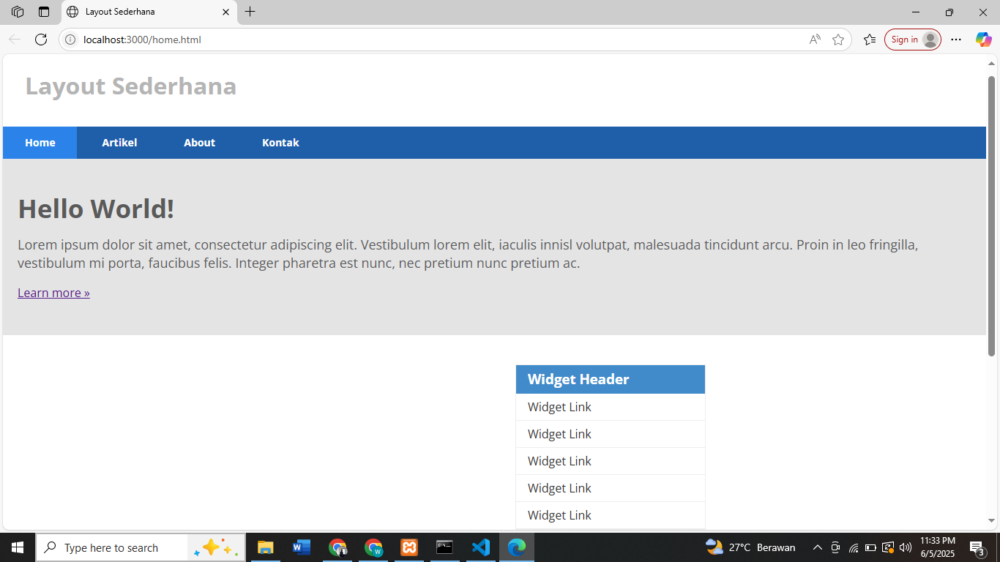
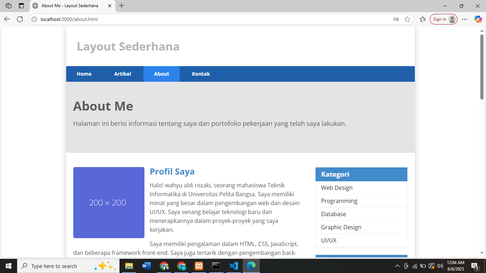
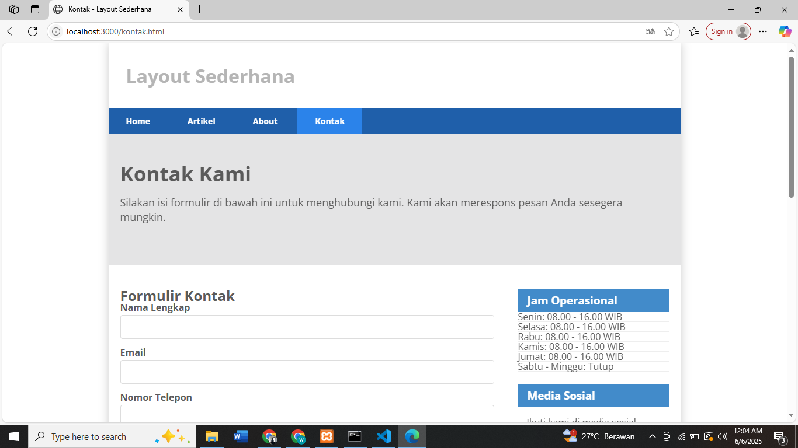

# Praktikum 4: CSS Layout

## Langkah-langkah Praktikum

### 1. Membuat Box Element
Membuat box element dengan tag div dan menambahkan CSS float property.

### 2. Mengatur Clearfix Element
Menambahkan element div baru dan mengatur property clear pada CSS.

### 3. Membuat Layout Sederhana
Membuat layout web sederhana dengan semantic element HTML5.

### 4. Membuat Navigasi
Mengatur navigasi pada layout web.

### 5. Membuat Hero Panel
Membuat hero panel dengan CSS.

### 6. Mengatur Layout Main dan Sidebar
Mengatur main content dan sidebar dengan CSS float.

### 7. Mengatur Footer
Mengatur tampilan footer dengan CSS.

### 8. Menambahkan Content Artikel
Membuat content artikel pada main content.

## Pertanyaan dan Tugas

### 1. Tambahkan Layout untuk Menu About
Membuat single layout yang berisi deskripsi, portfolio, dll.

### 2. Tambahkan Layout untuk Menu Contact
Membuat layout dengan form isian: nama, email, message, dll.

